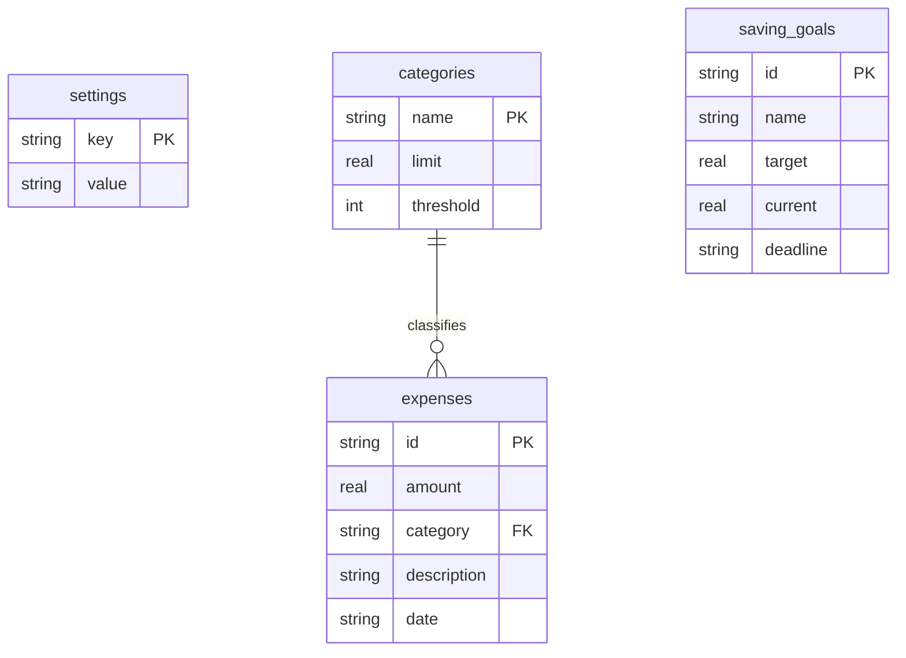

# StudentFinance — Personal Finance & Micro-Budgeting System for Students

**Hackathon Project Track:** Project No. 2 — Agentic Personal Finance and Micro-Budgeting System for Students  
**Domain:** FinTech / Student Life  
**Technology Stack:** React (Vite) + Python (FastAPI) + SQLite + CryptoJS  

---

## Problem Statement

Students manage small, irregular budgets from allowances or part-time jobs. They often lose track of spending on food, transport, subscriptions, and entertainment. Manual tracking is boring and gets abandoned quickly. This app solves that by giving students a fast, private budgeting tool that:

- Lets them log expenses rapidly by typing natural phrases (e.g., *"pizza $12 yesterday"*) using a smart local text parser.
- Automatically guesses the spending category based on keywords and lets the student correct it.
- Shows how much budget is left in each category with visual progress bars.
- Predicts if they will run out of money before the month ends based on daily spending velocity.
- Warns them when they are spending too fast in any category.
- Generates a monthly spending report from real data with automated savings tips.
- Tracks savings goals like buying a laptop or going on a trip.

---

## Features (Completed)

| Feature | Status | Where in Code |
|:--------|:------:|:--------------|
| Set monthly income/allowance | ✅ Done | `BudgetSettings.jsx` |
| Create and edit budget categories with limits | ✅ Done | `BudgetSettings.jsx` |
| Add expense manually (amount, category, date) | ✅ Done | `Dashboard.jsx`, `ExpenseTracker.jsx` |
| Add expense using smart text parsing | ✅ Done | `ExpenseTracker.jsx` → `server.py` |
| Smart auto-categorization with user correction | ✅ Done | `ExpenseTracker.jsx` (review & edit before saving) |
| Budget progress bars (per-category) | ✅ Done | `Dashboard.jsx` |
| Overspending warning alerts (threshold-based) | ✅ Done | `storage.js` → `Dashboard.jsx` |
| Month-end balance forecast | ✅ Done | `Dashboard.jsx` |
| Savings goal tracker (create, contribute, withdraw) | ✅ Done | `SavingsGoals.jsx` |
| Monthly spending report with category breakdown | ✅ Done | `MonthlyReport.jsx` |
| Data stored in real SQLite database | ✅ Done | `server.py` → `finance.db` |
| Offline fallback to browser localStorage | ✅ Done | `storage.js`, `App.jsx` |
| AES encryption of local browser data | ✅ Done | `storage.js` (CryptoJS) |
| Search and filter expenses | ✅ Done | `ExpenseTracker.jsx` |
| Delete individual expenses | ✅ Done | `ExpenseTracker.jsx` |
| Factory reset (clear all data) | ✅ Done | `BudgetSettings.jsx` → `server.py` |

---

## Architecture Diagram

```
┌─────────────────────────────────────────────┐
│              React Frontend (Vite)          │
│                                             │
│  Dashboard │ Expenses │ Goals │ Report │ Settings │
│                                             │
│  storage.js ─── AES encrypt ──► localStorage│
│      │                                      │
│      └── HTTP POST /api/sync-data ──────────┼──┐
│          HTTP GET  /api/finance-data ────────┼──┤
│          HTTP POST /api/parse-expense ───────┼──┤
│          HTTP POST /api/reset-data ──────────┼──┤
└─────────────────────────────────────────────┘  │
                                                 │
┌─────────────────────────────────────────────┐  │
│         Python FastAPI Backend (Port 5000)  │◄─┘
│                                             │
│  /api/finance-data   → Read all tables      │
│  /api/sync-data      → Write all tables     │
│  /api/parse-expense  → Smart text parser    │
│  /api/reset-data     → Wipe & re-seed       │
│  /api/health         → Server status check  │
│                                             │
│  parse_expense_local() ← Regex/keyword logic│
│                                             │
│  SQLite Driver (sqlite3) ──► finance.db     │
└─────────────────────────────────────────────┘
```

---

## Database Schema / ERD

The backend uses an SQLite database (`backend/finance.db`) with 4 active tables. 

*(Note: While the tables are built without strict technical `FOREIGN KEY` constraints to prevent offline sync crashes, the logical relationships and cardinality are enforced via the backend logic as mapped below).*



### Table Details

| Table | Purpose | Example Data |
|:------|:--------|:-------------|
| `settings` | Stores key-value configs like monthly income | `key: "income"`, `value: "1200"` |
| `categories` | Budget buckets with spending limits and warning thresholds | Food ($300 limit, warn at 80%) |
| `expenses` | Every transaction the student logs | Pizza $24, category: Food, date: 2026-06-15 |
| `saving_goals` | Long-term savings targets with progress tracking | "New Laptop", target: $900, saved: $250 |

---

## Setup & Run Instructions

### What You Need Installed
- **Node.js** v18 or newer
- **Python** 3.10 or newer

### Step 1: Set Up Environment Variables
Copy the example file and fill in your keys:
```bash
cp .env.example .env
```
Edit `.env`:
```
VITE_ENCRYPTION_KEY=any_random_secret_string
```

### Step 2: Start the Backend Server
```bash
cd backend
pip install -r requirements.txt
python server.py
```
The server starts on `http://localhost:5000`. On first run, it creates `finance.db` and fills it with default budget categories.

### Step 3: Start the Frontend
```bash
# In the project root folder (not backend)
npm install
npm run dev
```
Open `http://localhost:5173` in your browser.

---

## MVP Workflow (End-to-End Demo)

Follow this path to demonstrate the complete workflow to judges:

1. **Open the Dashboard** → See default monthly income ($0), zero spending, and no category progress bars.
2. **Go to "Settings"** → Set your monthly income and add a few custom categories (e.g., Food, Transport).
3. **Go to "Log Expenses"** → Type *"pizza party yesterday 25"* in the natural language box → Click **Parse** → The local regex system extracts amount ($25), category (Food), and description → **Review it, correct if needed**, then click **Confirm & Save**.
4. **Check the Dashboard again** → The progress bar has increased. If it crosses the 80% warning threshold, a yellow alert banner appears at the top.
5. **Check the Forecast** → The Dashboard shows the predicted month-end balance based on your average daily spending speed.
6. **Go to "Savings Goals"** → Create a goal for "New Laptop" ($900 target) → Add a $50 contribution.
7. **Go to "Monthly Report"** → See total transactions, average expense size, top spending day, category breakdown table, and automated savings tips calculated from real data.

---

## What is Completed and What is Future Scope

| Area | Status |
|:-----|:-------|
| Budget setup, expense logging, category management | ✅ Fully completed |
| Fast text-based expense parsing (local Python regex) | ✅ Fully completed |
| SQLite database persistence | ✅ Fully completed |
| Encrypted localStorage as offline fallback | ✅ Fully completed |
| Overspending alerts and month-end forecast | ✅ Fully completed |
| Savings goals with contribute/withdraw | ✅ Fully completed |
| Monthly report with category breakdown | ✅ Fully completed |
| Shared expense splitting with friends | 🔮 Future scope |
| Multi-user accounts with login | 🔮 Future scope |
| Mobile app version | 🔮 Future scope |

---

## How Privacy and Security Are Handled

1. **No cloud uploads**: All financial data stays strictly on your computer — either in the local SQLite file or encrypted in the browser.
2. **No Third-Party APIs**: The parsing logic is handled 100% locally via Python regex on your own machine.
3. **AES encryption**: Browser localStorage data is encrypted using CryptoJS AES before saving, so raw transaction details are never stored as plain text.
4. **Full data deletion**: The "Clear All Data" button in Settings wipes both the SQLite database and browser storage completely.

---

## AI Usage Declaration

| Question | Team Response |
|:---------|:-------------|
| Which AI tools were used? | Antigravity AI coding assistant. |
| Was AI used for coding assistance? | Yes. React component structure, FastAPI route boilerplate, and CSS styling were generated by AI and then reviewed, modified, and debugged by the team. |
| **Was AI used inside the product as a feature?** | **No.** The product does not connect to any external AI LLM APIs (like Gemini or OpenAI) at runtime. The "natural language" expense parser is built using traditional, local Python regex and keyword matching. |
| Which parts were built by the team? | The team built and refined the SQLite database schema, the offline sync architecture, the local regex parser, the budget alert logic, the forecast engine, and the monthly report calculations. |

---

## Known Limitations

1. **Single user only**: There is no login system. The app is designed for one student per browser/device.
2. **Local database**: The SQLite file is stored on the machine running the backend. If you switch computers, your data does not follow.
3. **No charts/graphs**: The monthly report uses tables and text. Visual charts (pie charts, bar graphs) are planned for a future version.

---

## Project Folder Structure

```
hackathon2/
├── backend/
│   ├── server.py          # FastAPI server + SQLite + Regex parser
│   ├── finance.db         # SQLite database file (auto-created)
│   └── requirements.txt   # Python dependencies
├── src/
│   ├── App.jsx            # Main app with tab navigation and state management
│   ├── index.css          # All CSS styles (dark theme, glassmorphism)
│   ├── main.jsx           # React entry point
│   ├── components/
│   │   ├── Dashboard.jsx      # Income/spent/remaining cards + forecast + category bars
│   │   ├── ExpenseTracker.jsx # Text input + manual form + transaction history
│   │   ├── BudgetSettings.jsx # Income editor + category manager + factory reset
│   │   ├── SavingsGoals.jsx   # Goal creation + contribute/withdraw
│   │   └── MonthlyReport.jsx  # Spending breakdown table + savings tips
│   └── utils/
│       ├── storage.js     # localStorage read/write + AES encryption + SQLite sync
│       └── api.js         # HTTP calls to backend endpoints
├── .env.example           # Template for environment variables
├── package.json           # Frontend dependencies (React, Vite, CryptoJS)
├── vite.config.js         # Vite configuration
└── README.md              # This file
```
