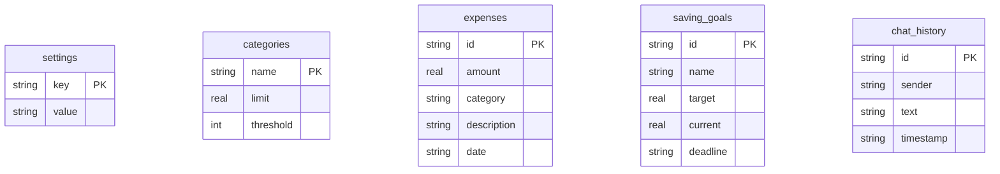

# Database & Relational Schema Details

To enhance data persistency and enable robust data grading, the application has transitioned from a browser-only storage architecture to a backend **SQLite database** (`finance.db`). 

Local storage is retained as a transparent **offline fallback** so that the application remains 100% operational even when the backend server is offline.

---

## 1. SQLite Relational Schema

The database consists of five tables managed dynamically by the FastAPI backend in `backend/server.py`.

### Table Definitions:
1. **`settings`**: Key-value pairs. Stores core user configurations such as the student's monthly allowance (`income`).
2. **`categories`**: Defines budget boundaries. Fields: `name` (e.g., *Food*, *Entertainment*), `limit` (max spend allowance), and `threshold` (the alert trigger percentage).
3. **`expenses`**: Holds itemized spending logs. Fields: unique transaction `id`, numerical `amount`, classification `category`, descriptive text `description`, and calendar `date`.
4. **`saving_goals`**: Tracks savings targets. Fields: unique `id`, goal `name` (e.g., *Laptop*), target financial `target`, current progress `current`, and target date `deadline`.
5. **`chat_history`**: Stores conversational context logs. Fields: unique message `id`, `sender` (*user* or *agent*), markdown `text` content, and ISO `timestamp`.

---

## 2. Seed Data Properties

Upon the first server startup (or after executing a database reset), the system detects if the settings table is empty and seeds a complete set of mock student finance profiles to immediately display realistic graphs:
- **Income allowance**: $1,200.00 / month.
- **Preconfigured categories**:
  - *Food* ($300 limit, warning at 80%)
  - *Transport* ($100 limit, warning at 80%)
  - *Subscriptions* ($50 limit, warning at 90%)
  - *Entertainment* ($150 limit, warning at 75%)
  - *Utilities* ($100 limit, warning at 90%)
  - *Emergencies* ($100 limit, warning at 100%)
- **Expenses**: Seeds 9 transactions totaling $210.98.
- **Active Savings Goals**:
  - *New M4 Laptop* ($900 target, $250 saved, deadline Oct 15)
  - *Summer Beach Trip* ($400 target, $120 saved, deadline Aug 01)
- **Chat**: Initial agent message greeting the student.

---

## 3. State Synchronization Flow

1. **Bootstrap (`App.jsx` Mount)**: 
   The React app starts up. It displays a loading skeleton while performing a `GET` request to `/api/finance-data`. 
   - *Online*: Updates the React state and synchronizes browser `localStorage`.
   - *Offline*: Gracefully falls back to browser `localStorage` state (so no data or state is lost).
2. **Reactive Updates**: 
   When the student updates records (logs an expense, changes limits, or contributes to goals), the React state updates instantly. 
   - It then writes changes to browser `localStorage`.
   - Simultaneously, it launches an asynchronous HTTP `POST` request to `/api/sync-data` to write the complete payload to the SQLite database.
3. **Synchronization Toasts**: 
   - Successful syncs trigger a green success notification: *"Synced to SQLite DB"*.
   - Connection failures trigger a yellow offline status banner with a retry link.
4. **Reset Actions**: 
   Clicking "Clear All Data" in Settings sends a `POST` request to `/api/reset-data` to drop tables and re-seed the SQLite database on the backend.
